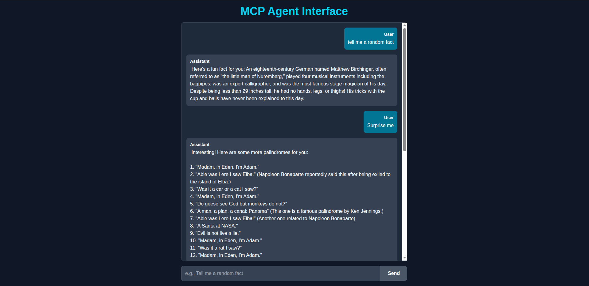

# Full-Stack AI Agent with Local LLM and MCP Server

This project is a complete, containerized application demonstrating a modern AI Agent architecture. It features a web-based chat interface that connects to a local Large Language Model (LLM) via Ollama to interact with a custom-built, MCP-compliant tool server.

The agent can understand user requests, decide when to use its "get random fact" tool, call the tool server, and then formulate a natural language response based on the tool's output. This project serves as a practical, hands-on example of building AI-powered applications from the ground up, entirely on local infrastructure.



---

Architecture
The project is composed of three core components orchestrated by Docker Compose:

Frontend & Agent Logic (Next.js): A React-based web UI provides a chat interface. This service also hosts the core "Agent" logic as a Node.js API route. This agent acts as the brain, communicating with the LLM to interpret user intent and coordinate actions.

MCP Server (Python & FastAPI): A lightweight backend service built with FastAPI that exposes a custom tool (get_random_fact) through a Model Context Protocol (MCP) compliant API. It's a standalone, reusable microservice.

Local LLM (Ollama): The project runs a local language model (e.g., mistral:7b) using Ollama. This model provides the reasoning capabilities for the agent, deciding whether to answer directly or to use the available tool.

The request-response flow is as follows:

```shell
[User] -> [1. Frontend UI] -> [Agent API Route] -> [3. Ollama LLM]
^ |
| (Final Formatted Answer) | (Decision: "Use 'get_random_fact' tool")
| v
+-------------------- [Agent API Route] <---> [2. MCP Server]
```

---

## Tech Stack

- **Frontend:** Next.js / React
- **UI Styling:** Tailwind CSS
- **Agent Logic:** Node.js, `ollama-js`
- **Backend (MCP Server):** Python 3.11, FastAPI
- **LLM Provider:** Ollama (running `mistral:7b` locally)
- **Containerization:** Docker & Docker Compose

---

## Prerequisites

Before you begin, ensure you have the following installed on your system:

- [Docker](https://www.docker.com/get-started)
- [Docker Compose](https://docs.docker.com/compose/install/) (usually included with Docker Desktop)
- [Ollama](https://ollama.com/)

---

## Getting Started

Follow these steps to get the project up and running.

1. Clone the Repository

   ```bash
   git clone <your-repo-url>
   cd <project-folder>
   ```

2. Install and Run the Local LLM
   This project is tested and configured to use `mistral`. Open a terminal and run the following command to pull and run the model.

   ```bash
   ollama run mistral
   ```

   This will download the model (approx. 4.1 GB). Once the download is complete and you see the chat prompt, you can type `/bye` to exit. Ollama will continue to serve the model in the background.

3. Configure Ollama for Network Access (Linux Only)
   By default, Ollama only listens for requests from `127.0.0.1` . To allow Docker containers to connect to it, you must configure it to listen on all network interfaces.

   **Note:** This step is crucial for Linux users. Docker for Mac/Windows handles this networking automatically.

   First, create a systemd override file for the Ollama service. The following command creates the directory and file, then writes the necessary configuration in one step.

   ```bash
   sudo mkdir -p /etc/systemd/system/ollama.service.d/ && echo '[Service]
   Environment="OLLAMA_HOST=0.0.0.0"' | sudo tee /etc/systemd/system/ollama.service.d/override.conf
   ```

   Then, reload the systemd daemon and restart Ollama for the changes to take effect:

   ```bash
   sudo systemctl daemon-reload
   sudo systemctl restart ollama.service
   ```

4. Build and Run the Application

   With Ollama running and correctly configured, navigate to the root of the project directory and start the entire application stack using Docker Compose:

   ```bash
   docker-compose up --build
   ```

This command will build the Docker images for the frontend and backend services and start them. The first build may take a few minutes.

## Usage

Once the containers are running, open your web browser and navigate to:

`http://localhost:3000`

You should see the chat interface. You can now interact with your local AI agent!

### Example Prompts

To use the tool: `Tell me a random fact.` or `I'm bored, surprise me.`

For a direct answer: `What is the capital of France?` or `Write a short poem.`

## Project Structure

.
├── backend/
│ ├── Dockerfile
│ ├── main.py
│ └── pyproject.toml
├── frontend/
│ ├── app/
│ │ ├── api/
│ │ │ └── agent/
│ │ │ └── route.js # Agent Logic
│ │ └── page.js # UI
│ ├── Dockerfile
│ ├── .dockerignore
│ └── ... (Next.js files)
├── MCP_shit.png
├── docker-compose.yml
└── README.md

## Key Learnings & Observations

A fascinating part of this project is observing the behavior of smaller local models (like mistral:7b). While capable, they can be overly eager to use their new tools. For instance, when asked a general knowledge question (e.g., "What is the capital of France?"), the model might still opt to call the get_random_fact tool instead of answering directly. This demonstrates a common challenge in AI agent development: ensuring models use tools appropriately and only when truly necessary. More powerful models or more sophisticated agent logic (e.g., adding a validation step) are common ways to address this in production systems.
